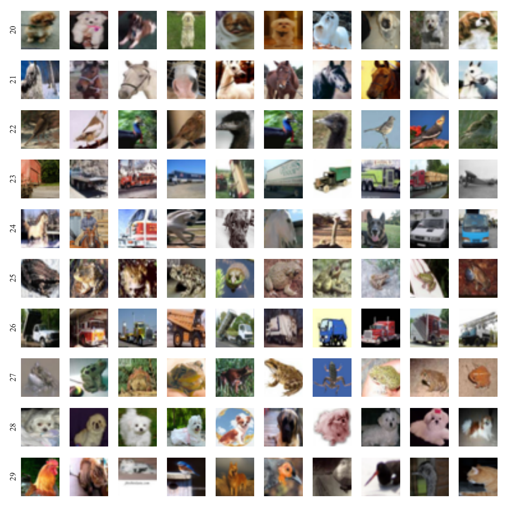
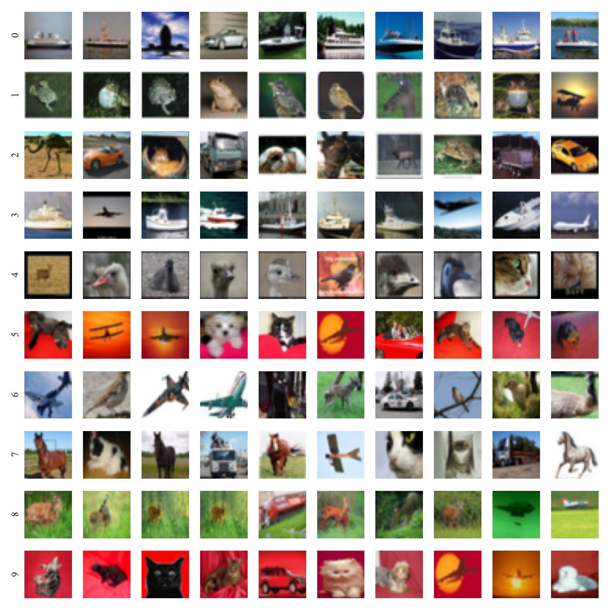
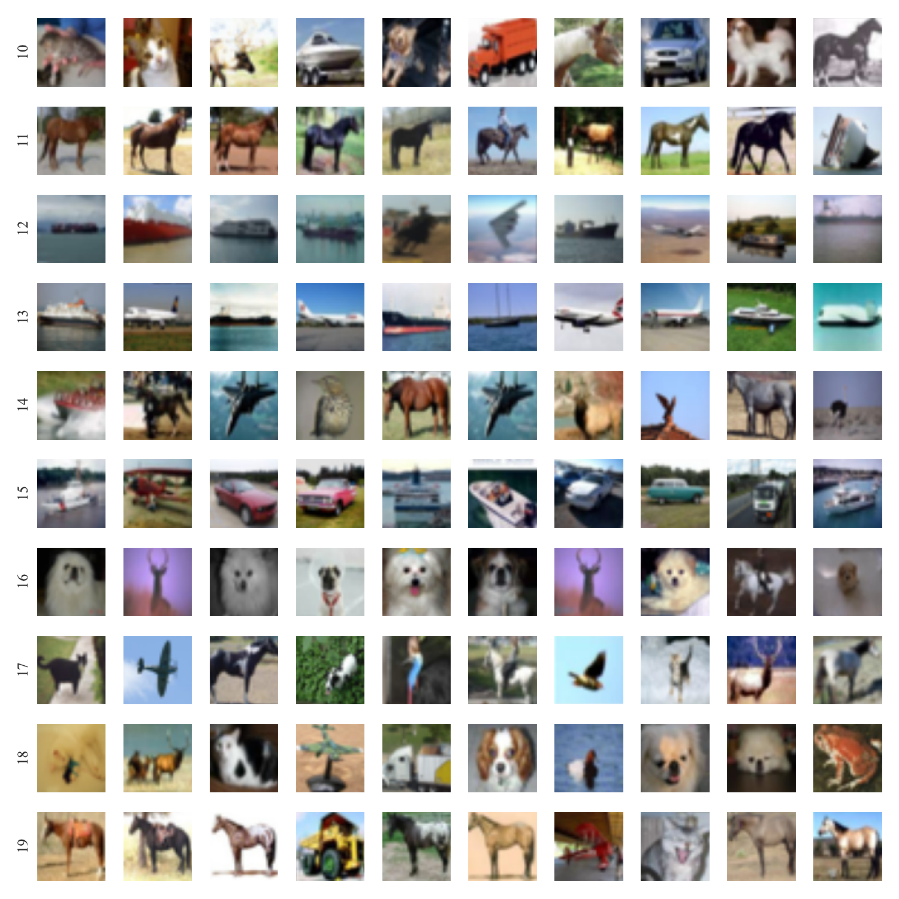

# Supplemental Materials for Complexity Estimator

This page provides supplemental materials to a paper, ["Model-based Data-complexity Estimator for Deep Learning Systems"](./aitest.pdf).
We show all results including the ones omitted from the paper due to space limit.

## RQ1. Feature Extraction
### Figure 4
Example of training data with large weight for some common feature obtained in a dense layer (*i.e.*, deep layer.)

### Figure 4' (Not shown in the paper)
Example of training data with large weight for ***each*** common feature obtained in a dense layer (*i.e.*, deep layer.)

### Figure 5
Example of training data with large weight for some common feature obtained in a convolution layer (*i.e.*, shallow layer.)

### Figure 5' (Not shown in the paper)
Example of training data with large weight for ***each*** common feature obtained in a convolution layer (*i.e.*, shallow layer.)

## RQ2. 

### Figure 6
Relationship between prediction accuracy and complexities.
When a model is trained on dataset (a),
as the test data are added in ascending (descending) order of complexities, the prediction accuracy decreases (increases).

### Figure 6' (Not shown in the paper)
Relationship between prediction accuracy and complexities.
We show ***result with a model trained on dataset (b).***
We also show ***results with a model trained on dataset (a) and tested on dataset (c'), (d'), and (e').***
  
Trained on dataset (b)  
  
Tested on dataset (c')  
  
Tested on dataset (d')  
  
Tested on dataset (e')  

### Figure 7
Proportion of labels in test data with top 10% complexities

### Figure 8
Example of inputs in a training dataset with high complexities.

### Figure 8' (Not shown in the paper)
Example of inputs ***randomly chosen from a training dataset***.
Images with red frames indicate suspicious data determined by one of authors.

### Figure 10
Histogram of complexities for various inclusion relations between training and test datasets.

### Figure 10'
Histogram of complexities for ***all layers and test datasets***.

### Figure 10''
Histogram of complexities for ***various models trained on different training datasets***. 
   
 
